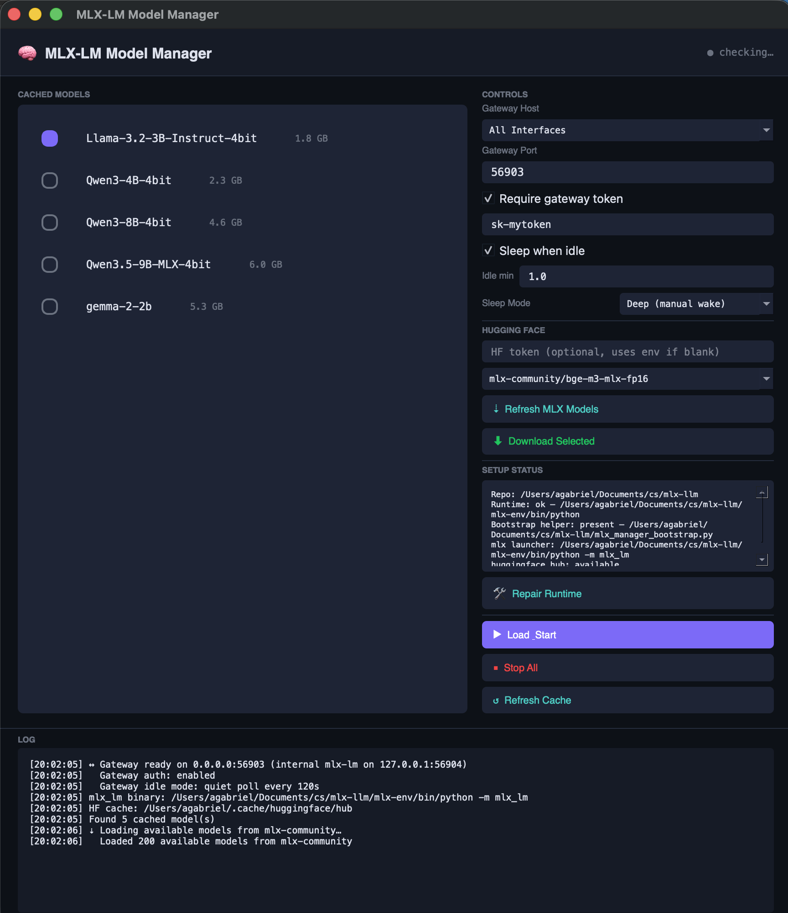
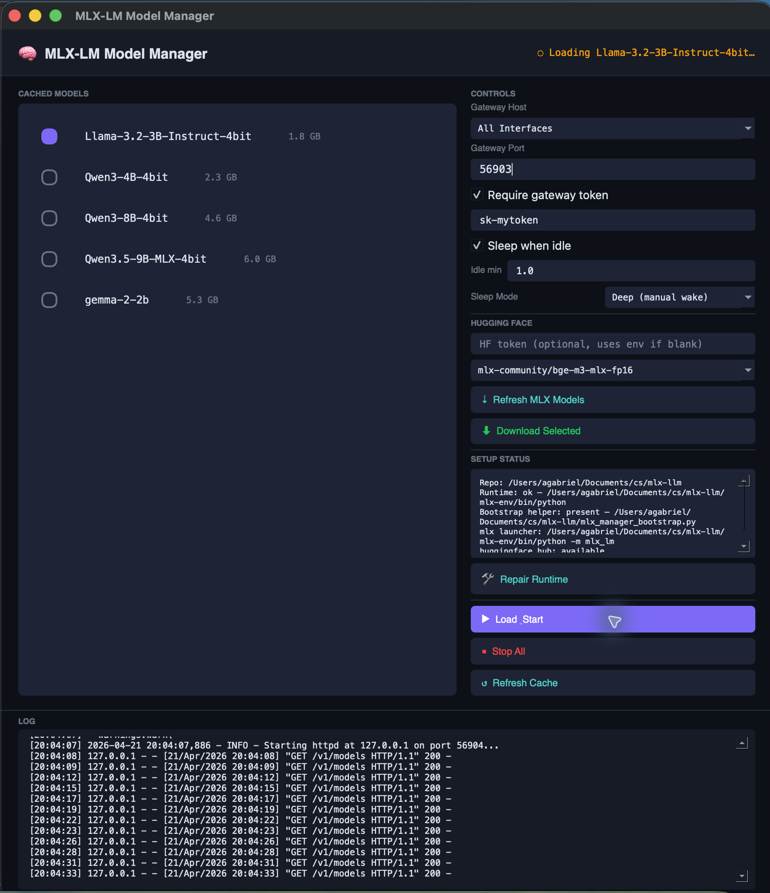
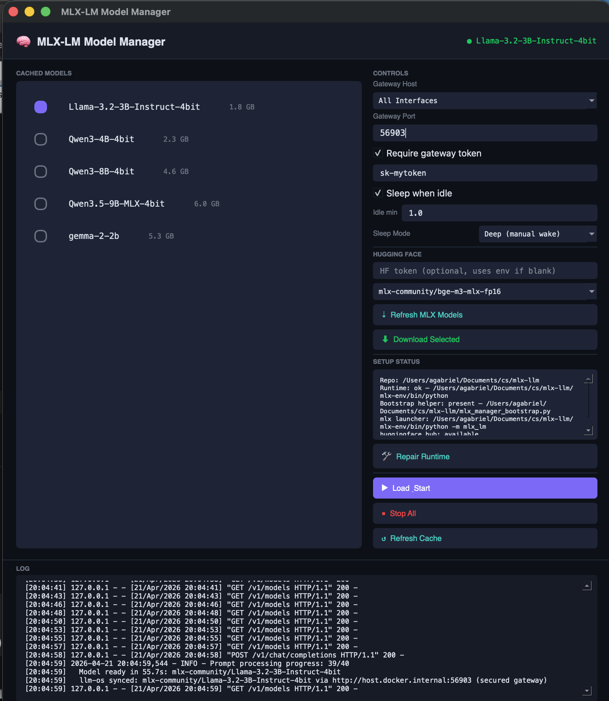
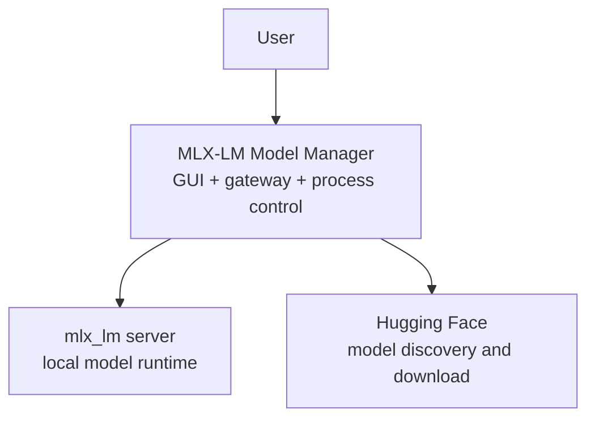
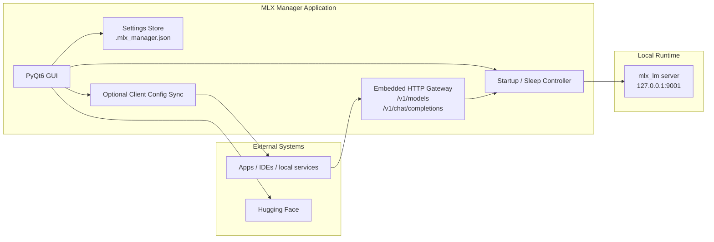
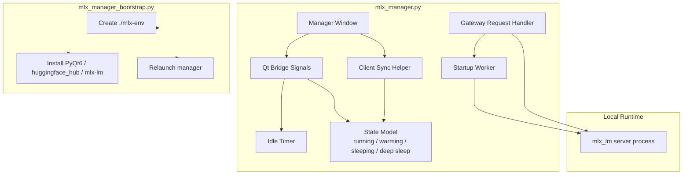

# MLX-LM Model Manager

A local desktop control plane for running `mlx_lm` models behind an OpenAI-compatible gateway, with an opinionated path for making a local model easy to operate and reuse from desktop clients.

This project keeps the **GUI** and the **serving daemon behavior** in one place:

- the GUI lets a user pick models, configure idle sleep, and manage Hugging Face access
- the embedded gateway exposes a local `/v1/models` and `/v1/chat/completions` surface
- the manager launches and stops the real `mlx_lm server` process on demand
- the manager can optionally sync the active local model configuration into compatible clients

The design goal is simple:

- make local MLX models easy to operate
- keep them optional and non-authoritative from the application point of view
- support low-friction local use, while still exposing a clean gateway contract to local clients

---

## What This Does

The manager provides:

- **model selection** from cached `mlx-community` models
- **first-run bootstrap** via `mlx_manager_bootstrap.py`
- **Hugging Face model browsing and download**
- **OpenAI-compatible local gateway** for apps and clients
- **standard health/readiness/status endpoints** for supervisors and clients
- **optional gateway bearer token**
- **idle sleep** with:
  - `Light (wake on request)`
  - `Deep (manual wake)`
- **real-question idle tracking** so readiness checks and model-list calls do not keep the LLM awake
- **token-use counters** for prompt/completion/total usage when the gateway can observe it
- **wake-on-request** for light sleep
- **streaming response passthrough** for OpenAI-compatible clients that request `stream=true`
- **optional runtime sync** so compatible clients can follow the selected model
- **activity / timing logs** for startup, forwarding, and idle behavior

---

## Files

Core files in this folder:

- [mlx_manager.py](./mlx_manager.py)
  Main GUI application, embedded gateway, runtime control, and optional client-sync logic.
- [mlx_manager_bootstrap.py](./mlx_manager_bootstrap.py)
  Stdlib-only first-run helper that creates `mlx-env`, installs dependencies, and relaunches the GUI.
- [docs/c4_architecture.md](./docs/c4_architecture.md)
  Full C4 architecture, state machine, and algorithm descriptions for startup, gateway forwarding, sleep/wake, token accounting, and client sync.
- [assets/mlx_gui_icon.png](./assets/mlx_gui_icon.png)
  GUI icon asset.
- [/.mlx_manager.json](./.mlx_manager.json)
  Persisted local settings and last-used values.

---

## Quick Start

### Recommended first run

```bash
python3 mlx_manager_bootstrap.py
```

This will:

1. create `./mlx-env` if needed
2. install/repair the minimum runtime packages
3. launch the manager in that runtime

### Run directly once the runtime exists

```bash
./mlx-env/bin/python mlx_manager.py
```

## Screenshots

### Overview

The main window shows cached models, gateway controls, runtime health, and the live log in one place.



### Starting a model

When you press `Load & Start`, the manager keeps the gateway up, launches the selected MLX model, and streams the startup progress into the log pane.



### Ready state

Once the model is ready, the status pill turns green and the log confirms the model is available and ready to serve requests through the secured gateway.



---

## Runtime Dependencies

The bootstrap helper installs:

- `PyQt6`
- `huggingface_hub`
- `mlx-lm`

The manager assumes:

- Apple Silicon / MLX-capable environment
- working `python3`
- internet access for first-run dependency install and model download

---

## Configuration

The manager persists user settings in:

- [/.mlx_manager.json](./.mlx_manager.json)

Typical persisted values include:

- selected model
- last running model
- gateway host mode
- gateway port
- gateway protocol (`http` or `https`)
- TLS certificate/key paths when HTTPS is selected
- gateway auth toggle/token
- idle sleep toggle
- idle minutes
- sleep mode
- Hugging Face token

The GUI is the preferred way to edit these.

---

## Host Modes

The gateway can bind in two ways:

- **All Interfaces**
  - binds to `0.0.0.0`
  - appropriate when a client is containerized and needs to reach the host through `host.docker.internal`
- **Localhost Only**
  - binds to `127.0.0.1`
  - appropriate when only local host processes should reach the model gateway

In practice, if a client is running in Docker, `All Interfaces` is usually the correct choice.

---

## Gateway Transport: HTTP Or HTTPS

The embedded gateway can run as either plain HTTP or HTTPS/TLS.

- **HTTP** is useful for localhost-only experiments and keeps compatibility with simple local tools.
- **HTTPS/TLS** is the preferred option when the gateway is reachable over a network interface.

When HTTPS is selected, MLX Manager uses the certificate and key paths shown in the GUI. If the default paths are used and the files do not exist, the manager generates a local self-signed certificate under `certs/`. That is good for local encrypted testing, but clients such as LLM-OS must either disable certificate verification for that local self-signed cert or be configured with a trusted CA bundle.

For production-like use, provide a real certificate/key pair and keep client certificate verification enabled.

---

## Gateway Auth

The embedded gateway supports bearer-token auth. Auth defaults on for the secure path, and the user can explicitly disable it in the GUI for isolated local experiments.

If enabled:

- `GET /v1/models` requires `Authorization: Bearer <token>`
- `POST /v1/chat/completions` requires `Authorization: Bearer <token>`
- `GET /status` requires `Authorization: Bearer <token>`

`GET /health` and `GET /ready` are intentionally unauthenticated so local
supervisors, launch agents, and simple clients can distinguish "gateway alive"
from "model ready" without sending a generation request.

Default testing token in this project has often been:

```text
sk-mytoken
```

But the user can set any token in the GUI.

When the token, auth toggle, host mode, or gateway port changes, MLX Manager persists the new gateway settings and re-syncs compatible clients such as LLM-OS. The sync cache includes the model, visible state, base URL, auth flag, and effective token so a token-only change is not skipped as a duplicate model update.

When the protocol changes, MLX Manager also re-syncs the client base URL as either `http://...` or `https://...` and sends the configured client SSL verification preference.

---

## Gateway Contract

The gateway keeps its serving surface intentionally close to the OpenAI API so
LLM-OS, opencode, IDEs, scripts, and other local tools can all use the same
configuration style.

| Endpoint | Auth | Purpose |
| --- | --- | --- |
| `GET /health` | No | Returns `200` when the gateway process is alive. |
| `GET /ready` | No | Returns `200` only when a model is ready; otherwise `503` with `Retry-After`. |
| `GET /status` | Yes, when auth is enabled | Full machine-readable state, model, idle policy, usage, and gateway/internal ports. |
| `GET /v1/models` | Yes, when auth is enabled | OpenAI-compatible model list plus MLX state metadata. |
| `POST /v1/chat/completions` | Yes, when auth is enabled | OpenAI-compatible chat completion; supports blocking and streaming requests. |

Retryable warm/sleep errors use an OpenAI-style envelope:

```json
{
  "error": {
    "message": "Model is warming or waking; retry shortly.",
    "type": "model_warming",
    "code": "service_unavailable",
    "state": "warming"
  },
  "message": "Model is warming or waking; retry shortly.",
  "state": "warming"
}
```

Clients should treat `model_warming`, `model_sleeping`, HTTP `202`, `503`, and
`504` as retryable when the request is a real chat request.

---

## Sleep Modes

### Light sleep

- model process stops
- gateway stays up
- incoming requests can wake the model
- better convenience
- slightly more background footprint

### Deep sleep

- model process stops
- gateway stops too
- user wakes it manually with `Load & Start`
- best battery savings

Use `Deep` when battery life matters more than auto-wake behavior.

---

## Logging and Validation

The manager logs important operational events, including:

- model startup commands
- readiness timing
- request forward timing
- forward timeouts/failures
- idle timeout behavior after real user questions
- token-use summaries in the GUI
- gateway activity summaries while paused

Useful log lines include:

- `Model ready in ...s`
- `Forwarded request completed in ...s`
- `Forward request failed after ...s (state=...)`
- `Gateway activity while paused: ...`
- `No real question for ... min`

---

## How It Fits Into a Local AI Stack

The manager is **not** the source of truth for application behavior. It is a **local model backend**.

Connecting apps and clients should remain robust when the MLX backend is:

- warming
- sleeping
- unavailable
- slow

That means the manager fits best as:

- a **local execution substrate**
- a **model availability provider**
- an **optional local-first backend**

It should not be treated as the place where business logic lives.

---

## C4 Model: System Context



### Interpretation

- the **user** interacts with both the GUI and local clients
- Clients use the manager’s gateway as a local LLM endpoint
- the manager controls the real `mlx_lm` subprocess
- the manager pulls models from Hugging Face

---

## C4 Model: Container View



### Interpretation

Inside the desktop app, there are five main containers:

- **GUI** for user interaction
- **settings store** for persisted local configuration
- **embedded gateway** for OpenAI-compatible local access
- **runtime controller** for launching/stopping/sleeping the model process
- **optional sync client** for updating compatible client configuration when that integration is enabled

---

## C4 Model: Component View



### Interpretation

Important implementation ideas:

- **bridge signals** are used to get UI-safe behavior across worker threads
- **idle timing** uses the Qt timer plus a lightweight watchdog so a stale UI
  state cannot keep the model awake past the configured idle deadline
- **gateway** accepts local requests and can trigger startup/wake behavior
- **startup worker** handles bounded readiness loops
- **bootstrap helper** keeps first-run install/repair out of the GUI’s critical path

---

## Operational Design Choices

### Why keep GUI and daemon together?

Pros:

- simpler deployment for one-user local setups
- fewer moving parts
- easier model switching and token configuration
- GUI and gateway state stay close together

Cons:

- GUI and serving concerns are coupled
- desktop process health affects serving path
- harder to make the serving layer independently robust than a dedicated daemon

Current project choice:

- keep them together
- use threads and explicit state boundaries to get most of the robustness benefits without introducing a separate daemon package

---

## Known Tradeoffs

### Strengths

- straightforward local deployment
- clear GUI for model operations
- OpenAI-compatible gateway surface
- integrates naturally with local apps that speak an OpenAI-style API
- practical battery-saving modes

### Weaknesses

- local MLX runtime is still more operationally fragile than a fully managed cloud backend
- warm/start latency can be noticeable
- battery usage still depends on user sleep mode and traffic pattern
- `mlx_lm server` is not intended as a hardened production service

---

## Recommended Usage Pattern

For most local-first users:

- use **All Interfaces** if a client runs in Docker
- keep **gateway auth optional**
- use **Light sleep** if convenience matters most
- use **Deep sleep** if battery life matters most
- let connected apps treat MLX as a helper backend, not the source of truth for deterministic workflows

---

## Troubleshooting

### The gateway responds but the model is not answering

Check the log for:

- `Waiting for generation readiness`
- `Model ready in ...s`
- `Forward request failed after ...s`

This usually means the gateway is up but the model is still warming or timing out.

Current behavior:

- Light sleep should wake on the first real chat request.
- If the internal MLX server briefly reports `Model warming`, the gateway retries the forwarded request before returning an error.
- Compatible clients should also treat MLX warmup errors as retryable because wake latency is normal after sleep.
- `GET /ready` should report `503` with `state=sleeping` or `state=warming` until generation is actually available.

### Idle sleep does not trigger

Check:

- `Sleep when idle` is enabled
- `Idle min` is set to the expected value
- which sleep mode is active
- whether the GUI shows real questions being detected in `IDLE / TOKEN USE`
- whether a client is sending non-probe `POST /v1/chat/completions` traffic

`GET /v1/models`, empty chat-completion bodies, and small `ping`/`health` probe prompts should not count as real activity.

### A client cannot reach the model

Check:

- host mode (`All Interfaces` vs `Localhost Only`)
- gateway port
- bearer token if enabled
- the client’s base URL / endpoint configuration

### First run fails

Run:

```bash
python3 mlx_manager_bootstrap.py --ensure-only
```

Then retry launching the manager.

---

## Next Improvements

Likely next changes:

- stronger startup/warm-state telemetry
- clearer on-battery defaults
- optional “deep sleep by default on battery” behavior
- richer diagnostics around repeated request wakeups
- optional separation of gateway and GUI in the future if the project outgrows the current hybrid model
