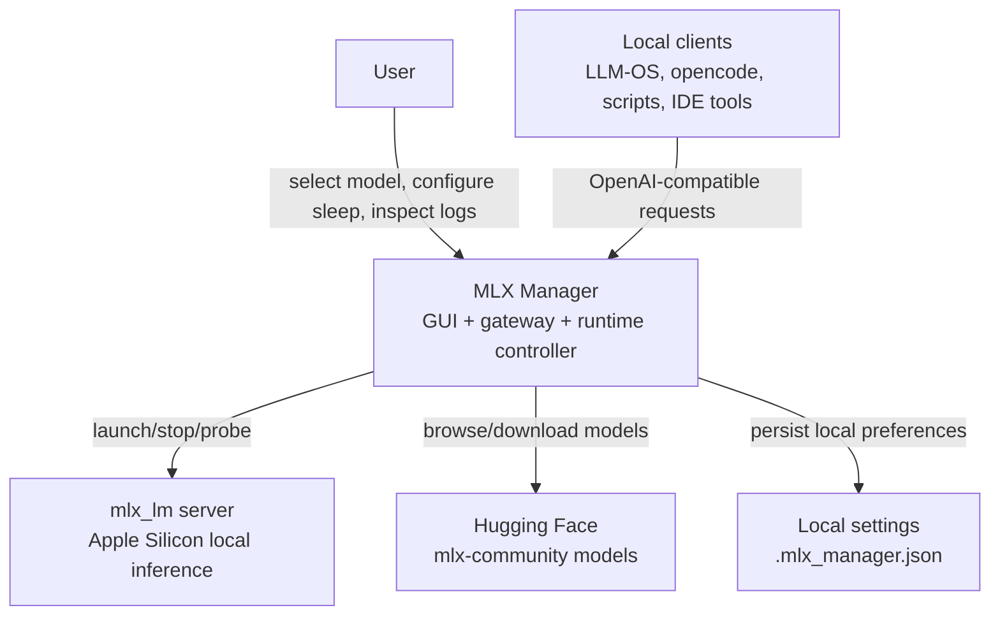
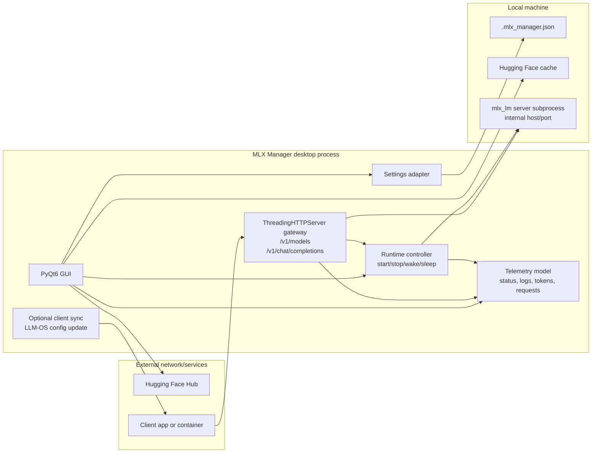
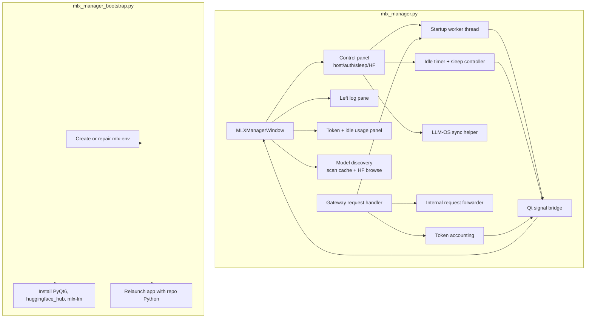
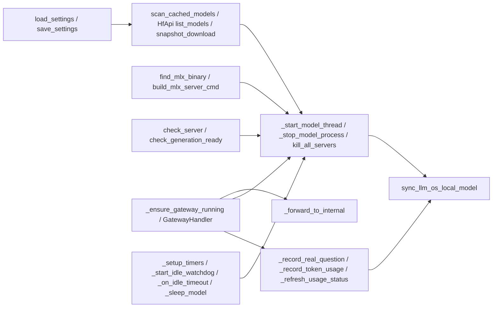
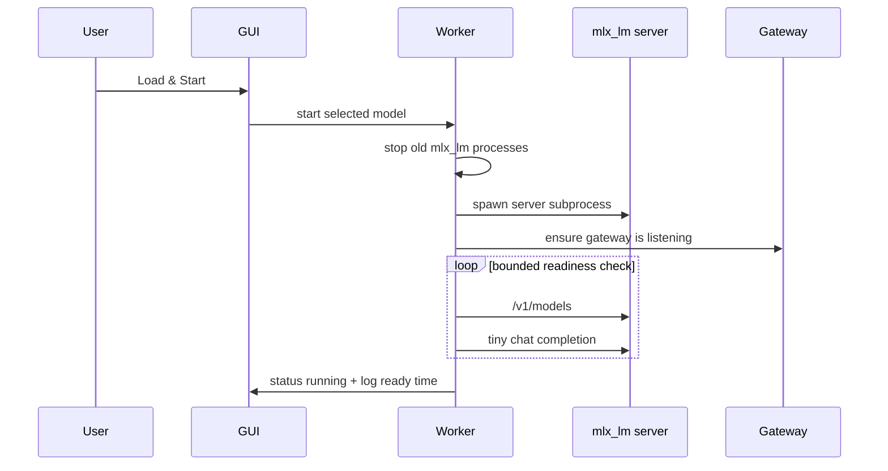
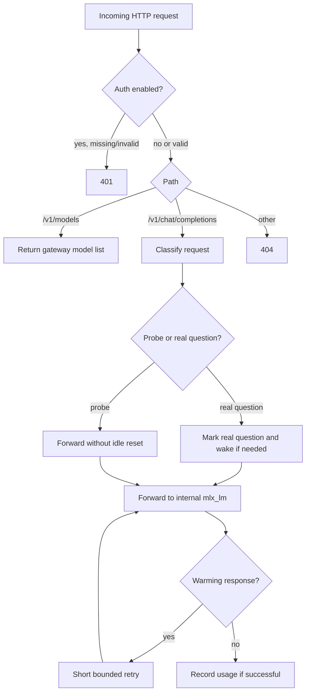
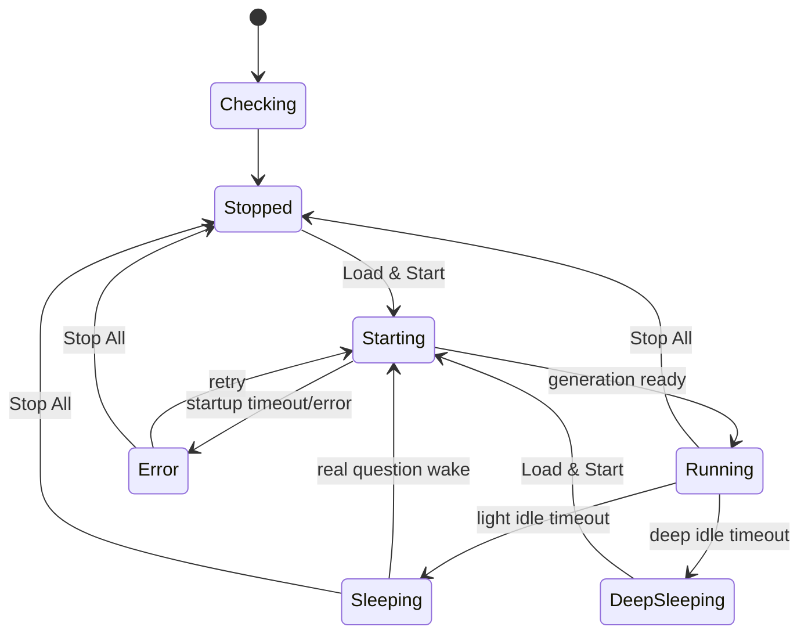

# MLX Manager C4 Architecture And Algorithms

This document describes how `mlx_manager.py` fits into a local AI stack, how its major parts cooperate, and which algorithms keep the GUI usable while the model server starts, sleeps, wakes, and reports usage.

The design center is a single-user desktop workflow:

- keep the GUI and local gateway in one process for easy installation
- keep the heavy model in a separate `mlx_lm server` subprocess
- expose an OpenAI-compatible gateway to local tools
- make sleep/wake and token visibility obvious to the user

---

## C4 Level 1: System Context

### Responsibility

MLX Manager is an operator-facing control plane for local MLX inference. It is not meant to own application business logic. Apps should treat it as an optional local LLM backend that can be running, warming, paused, deeply asleep, or unavailable.

---

## C4 Level 2: Container View

### Container Boundaries

- **GUI:** Presents model selection, host/auth controls, sleep state, token counters, setup status, and the left-side log pane.
- **Gateway:** Provides an OpenAI-compatible surface and decides whether a request is a real question, readiness probe, model-list query, or auth failure.
- **Runtime controller:** Owns model subprocess lifecycle, generation readiness checks, expected exits, and sleep/wake transitions.
- **Telemetry model:** Aggregates logs, status, last activity, real-question timestamps, request windows, and token counters.
- **Optional client sync:** Pushes the selected local model endpoint into compatible clients when enabled.
- **Settings adapter:** Reads and writes local GUI preferences.

---

## C4 Level 3: Component View

### Component Rules

- Worker threads must update the GUI through `_Bridge` signals only.
- The gateway may trigger startup, but the GUI owns visible state and user controls.
- Token counters are best-effort; exact OpenAI-style `usage` fields win, otherwise estimates are used.
- Real-question detection excludes model-list calls, health probes, tiny readiness prompts, and empty chat bodies.

---

## C4 Level 4: Code-Level Map

### Important State Variables

- `_status`: current visible state such as `running`, `starting`, `sleeping`, `stopped`, or `error`
- `_current_model`: model selected or last known runnable model
- `_running_id`: model advertised by the live MLX server
- `_sleeping`: light sleep, gateway remains available
- `_deep_sleeping`: deep sleep, gateway stopped and manual wake is required
- `_last_real_question_at`: last user-like chat request used for idle decisions
- `_token_stats`: cumulative and last-request token counters

---

## Algorithm 1: Bootstrap And Relaunch

Goal: make `mlx_manager.py` useful even when the user starts it with a system Python that lacks PyQt6 or MLX dependencies.

1. `mlx_manager.py` checks whether `./mlx-env/bin/python` exists.
2. If missing, it executes `mlx_manager_bootstrap.py`.
3. The bootstrap helper creates or repairs `mlx-env`.
4. It installs or verifies `PyQt6`, `huggingface_hub`, and `mlx-lm`.
5. It relaunches `mlx_manager.py` using the repo-local Python.
6. The main process avoids repeated bootstrap loops using environment flags.

Best practice:

- Keep bootstrap stdlib-only so it can run before third-party dependencies exist.
- Keep GUI startup small; heavy install/repair work belongs in the bootstrap helper or a repair action.

---

## Algorithm 2: Model Discovery

Goal: show models already available locally and optionally let the user download additional `mlx-community` models.

1. Scan the Hugging Face cache for `models--...` folders.
2. Convert cache folder names back into model IDs.
3. Estimate local model size by summing snapshot file sizes.
4. Populate cached model radio buttons.
5. Use Hugging Face Hub API to list popular `mlx-community` models.
6. Download the selected remote model with `snapshot_download`.
7. Refresh the local cache view after download.

Reliability notes:

- Cached models are usable without a network connection.
- Hugging Face browsing/download is optional and can fail without breaking local serving.

---

## Algorithm 3: Start Model

Goal: launch one MLX model, keep the GUI responsive, and only report readiness after generation works.

Detailed steps:

1. Validate selected model, port, host, and token settings.
2. Stop any prior `mlx_lm server` process.
3. Spawn `mlx_lm server --model ... --host 127.0.0.1 --port internal_port`.
4. Stream subprocess logs into the GUI through bridge signals.
5. Probe `/v1/models` until the model is advertised.
6. Probe `/v1/chat/completions` with a tiny deterministic prompt.
7. Mark the model as running only after the completion probe succeeds.
8. Optionally sync compatible clients to the new endpoint.

Design choice:

- The internal MLX server stays bound to localhost. The manager gateway decides whether external clients can reach it.

---

## Algorithm 4: Gateway Request Handling

Goal: expose a stable OpenAI-compatible endpoint while separating probes from real user questions.

Real-question detection excludes:

- `GET /v1/models`
- empty chat-completion requests
- health/readiness prompts such as `ping` or `READY`
- very small probe completions with low `max_tokens`

This prevents monitoring traffic from keeping the model awake.

---

## Algorithm 5: Light Sleep And Wake-On-Request

Goal: save battery without requiring a manual restart for normal use.

1. The Qt idle timer checks elapsed time since real model activity.
2. A lightweight watchdog also checks the saved idle policy and last real-question/activity timestamp.
3. If idle sleep is enabled and the threshold is exceeded, stop the MLX subprocess.
4. Keep the gateway alive.
5. Preserve `_current_model` and last-running model settings.
6. Mark status as sleeping.
7. When a real chat request arrives, start the last selected model.
8. Wait for generation readiness.
9. Forward the original request after the model is ready.
10. If the internal server still returns a transient warming response, retry the forward briefly before surfacing an error.

Tradeoff:

- Light sleep improves convenience but still keeps the gateway process alive.
- Wake latency includes model startup and readiness checks.

---

## Algorithm 6: Deep Sleep

Goal: maximize battery savings when convenience matters less.

1. Stop the MLX subprocess.
2. Stop the gateway.
3. Preserve the last selected/running model.
4. Mark status as deep sleeping.
5. Require the user to press `Load & Start` to wake.

Tradeoff:

- Deep sleep avoids passive gateway overhead.
- Clients cannot wake the model automatically.

---

## Algorithm 7: Token Accounting

Goal: give the user practical visibility into model usage without requiring provider-grade metering.

1. On successful chat completion responses, parse the response body.
2. If the response includes OpenAI-style `usage`, use exact counts.
3. Otherwise estimate prompt tokens from request messages.
4. Estimate completion tokens from the assistant response text.
5. Update cumulative totals:
   - real questions
   - prompt tokens
   - completion tokens
   - total tokens
   - exact-token total
   - estimated-token total
   - last request token count
6. Refresh both the header token summary and the detailed token-use panel.

Important caveat:

- Estimated counts are for operational awareness, not billing-grade accounting.

---

## Algorithm 8: Optional Client Sync

Goal: make compatible tools discover the currently selected local model without hand-editing their config.

1. Read compatible client LLM configuration.
2. Set local backend enabled.
3. Set backend type to `mlx_lm`.
4. Set base URL to the gateway URL appropriate for host mode.
5. Set the active model ID.
6. Apply auth settings if gateway auth is enabled.
7. Persist the client config.
8. Log whether sync succeeded or was skipped.

Duplicate-sync suppression uses a full connection signature:

- selected model
- reported state
- client-visible base URL
- auth-enabled flag
- effective gateway token when auth is enabled

This prevents a token-only or host-only change from being skipped just because the same model is still selected.

Safety rule:

- Sync is advisory. The client still owns its routing and fallback behavior.

---

## State Machine

### State Invariants

- `Running` means `/v1/chat/completions` has succeeded at least once for the active model.
- `Sleeping` means the gateway remains alive but no MLX subprocess should be consuming model resources.
- `DeepSleeping` means both gateway and model are stopped.
- `Starting` must not block the GUI thread.

---

## Operational Guarantees

The manager should guarantee:

- GUI remains usable while startup, download, and request forwarding occur.
- Logs are visible without scrolling the whole window.
- Token usage is visible in the upper-right header and detailed control panel.
- The active model is preserved across sleep/wake when possible.
- Monitoring traffic does not reset the real-question idle timer.
- A sleeping model can be woken by a real request in light-sleep mode.

The manager does not guarantee:

- production-grade auth or multitenant isolation
- exact billing-token accounting for every backend response
- zero-latency wake
- protection from MLX runtime bugs or model-specific resource pressure

---

## Testing Checklist

Use this checklist when changing the manager:

- Launch directly with `./mlx-env/bin/python mlx_manager.py`.
- Confirm the log pane is visible on the left at startup.
- Confirm the upper-right token summary is visible.
- Start a cached model and verify status reaches running.
- Call `GET /v1/models`; confirm it does not count as a real question.
- Send a small real chat completion; confirm real-question count and token counters update.
- Wait for idle timeout or temporarily lower idle minutes; confirm sleep state is visible.
- In light sleep, send a real chat request and confirm wake-on-request.
- In deep sleep, confirm the gateway stops and manual wake is required.
- Confirm `Stop All` terminates the MLX subprocess and updates status.
